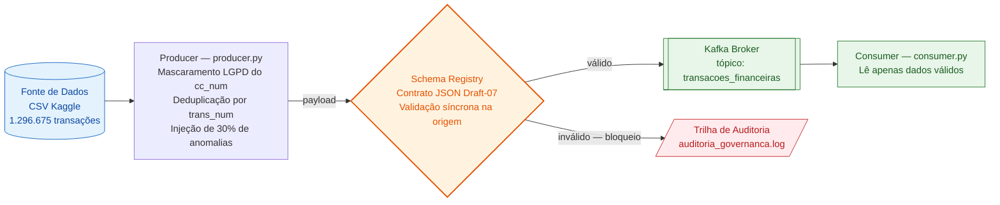
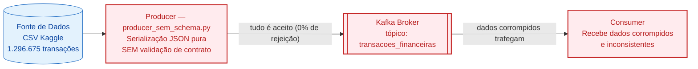

# Governança de Dados Financeiros em Arquiteturas de Streaming com Kafka

Repositório de código-fonte e infraestrutura da Prova de Conceito (PoC) desenvolvida para o
Trabalho de Conclusão de Curso (TCC) em Sistemas de Informação — PUC Minas, Instituto de
Ciências Exatas e de Informática.

O projeto demonstra um modelo de **Governança Preventiva na Origem**, usando Apache Kafka e
Confluent Schema Registry para **validar, auditar e mascarar (LGPD)** transações financeiras em
tempo real, bloqueando dados fora de conformidade **antes** que eles entrem no fluxo de eventos.

> **Autores:** Ana Flávia de Oliveira Costa e Derick Lucas Alves Rodrigues
> **Orientadora:** Maria Ines Lage de Paula

---

## Sumário

- [Arquitetura](#arquitetura)
- [Estrutura do repositório](#estrutura-do-repositório)
- [Pré-requisitos](#pré-requisitos)
- [Base de dados (download)](#base-de-dados-download)
- [Passo a passo para reprodução](#passo-a-passo-para-reprodução)
- [Contrato de dados (schema.json)](#contrato-de-dados-schemajson)
- [Resultados](#resultados)

---

## Arquitetura

A PoC é avaliada em **dois cenários** que compartilham a mesma infraestrutura, isolando o efeito
da camada de governança. As versões em imagem (PNG/SVG) para reuso em apresentações estão na
pasta [`docs/`](docs/).

### Cenário A — Com Governança Preventiva (`producer.py`)

O `Producer` intercepta cada transação e a valida de forma **síncrona** contra o contrato JSON
no Schema Registry. Mensagens válidas seguem para o tópico do Kafka; mensagens fora do contrato
são bloqueadas e registradas na trilha de auditoria, sem interromper o fluxo.



📎 Imagem: [`docs/diagrama_com_governanca.png`](docs/diagrama_com_governanca.png) · [`.svg`](docs/diagrama_com_governanca.svg)

### Cenário B — Sem Governança (`producer_sem_schema.py`)

Cenário de controle. O `Producer` serializa a transação como JSON puro e a publica diretamente
no Kafka, **sem nenhuma validação de contrato**. Todas as mensagens são aceitas — inclusive as
corrompidas — e trafegam até o consumidor.



📎 Imagem: [`docs/diagrama_sem_governanca.png`](docs/diagrama_sem_governanca.png) · [`.svg`](docs/diagrama_sem_governanca.svg)

---

## Estrutura do repositório

```
TCC/
├── data/                                  # base de dados (NÃO versionada — ver data/README.md)
│   └── README.md                          # como baixar o CSV do Kaggle e onde colocá-lo
├── docs/                                  # diagramas de arquitetura (fonte .mmd + PNG/SVG)
│   ├── diagrama_com_governanca.mmd
│   ├── diagrama_com_governanca.png
│   ├── diagrama_com_governanca.svg
│   ├── diagrama_sem_governanca.mmd
│   ├── diagrama_sem_governanca.png
│   └── diagrama_sem_governanca.svg
├── src/
│   ├── producer.py                        # Cenário A: produtor COM validação (Schema Registry)
│   ├── producer_sem_schema.py             # Cenário B: produtor SEM validação (controle)
│   ├── consumer.py                        # consumidor do tópico transacoes_financeiras
│   ├── demo_validacao_regras.py           # demonstra cada regra do contrato isoladamente
│   ├── schema.json                        # contrato de dados (JSON Schema Draft-07)
│   ├── resultados_benchmark.txt           # métricas coletadas — Cenário A
│   └── resultados_benchmark_sem_governanca.txt  # métricas coletadas — Cenário B
├── docker-compose.yml                     # Kafka + Zookeeper + Schema Registry
└── requirements.txt                       # dependências Python
```

---

## Pré-requisitos

- [Docker Desktop](https://www.docker.com/products/docker-desktop/) com a *engine* em execução.
- [Python 3.x](https://www.python.org/downloads/).

---

## Base de dados (download)

O dataset tem 1.296.675 registros e **não é versionado** neste repositório. Antes de executar,
baixe o CSV do Kaggle e coloque-o em `data/credit_card_transactions.csv`.

👉 As instruções completas (download manual ou via Kaggle CLI) estão em **[`data/README.md`](data/README.md)**.

---

## Passo a passo para reprodução

### 1. Provisionar a infraestrutura

Com o Docker Desktop aberto, na raiz do projeto, suba Kafka, Zookeeper e Schema Registry:

```bash
docker-compose up -d
```

### 2. Criar e ativar o ambiente virtual

```bash
python -m venv venv
```

Ativação conforme o sistema operacional:

```bash
# Windows (PowerShell)
venv\Scripts\activate

# Linux / Mac
source venv/bin/activate
```

### 3. Instalar as dependências

```bash
pip install -r requirements.txt
```

### 4. Baixar a base de dados

Siga as instruções de **[`data/README.md`](data/README.md)** e confirme que o arquivo está em
`data/credit_card_transactions.csv`.

### 5. Executar os microsserviços

Abra **dois terminais**, ambos com o ambiente virtual ativado e dentro da pasta `src/`. Execute
primeiro o consumidor e depois o produtor:

```bash
# Terminal 1 — Consumidor
python consumer.py

# Terminal 2 — Produtor (Cenário A, com governança)
python producer.py
```

> Para reproduzir o cenário de controle (sem governança), use `python producer_sem_schema.py`
> no lugar do `producer.py`.

---

## Contrato de dados (`schema.json`)

O contrato em [`src/schema.json`](src/schema.json) (JSON Schema **Draft-07**) materializa as
regras de governança. Toda transação enviada no Cenário A é validada campo a campo contra ele:

| Campo | Regra | Objetivo |
| --- | --- | --- |
| `trans_num` | `string`, `minLength: 10` | Identificador único não pode ser vazio |
| `cc_num` | `string`, `pattern: ^\*+[0-9]{4}$` | **LGPD:** cartão deve estar mascarado, terminando em 4 dígitos |
| `amt` | `number`, `exclusiveMinimum: 0`, `maximum: 500000` | Valor plausível: maior que 0 e menor que 500.000 |
| `merchant` | `string`, `minLength: 3` | Estabelecimento obrigatório e padronizado |
| `trans_date_trans_time` | `string`, `pattern: YYYY-MM-DD HH:MM:SS` | Formato temporal restrito |

Todos os cinco campos são **obrigatórios** (`required`). A escolha do JSON Schema (em vez de um
formato binário como Avro) foi deliberada: ele permite incorporar validações semânticas e regras
de negócio — como o *regex* de mascaramento da LGPD — diretamente no contrato.

### Demonstração das regras de validação

O benchmark principal (`producer.py`) injeta apenas **um** tipo de anomalia em escala: a ausência
de campo obrigatório. As demais regras do contrato (máscara do cartão, limites de valor, formato
de data, tamanho mínimo de texto) não são exercitadas ali, pois isso exigiria corromper a base de
dados real.

Para demonstrar que **todas** as regras funcionam, o script
[`src/demo_validacao_regras.py`](src/demo_validacao_regras.py) envia um conjunto pequeno de
mensagens **sintéticas** (não lê o CSV) pela **mesma** barreira de validação do `producer.py`
— `SerializingProducer` + Schema Registry. Cada mensagem quebra exatamente uma regra e é
rejeitada, com o motivo gravado em `auditoria_demo.log`. Também demonstra a deduplicação por
`trans_num`.

Com a stack Docker no ar, execute de dentro da pasta `src/`:

```bash
python demo_validacao_regras.py
```

Saída esperada (ilustrativa):

```
[ 2] Cartão SEM máscara (viola regex LGPD do cc_num)
     Esperado: BLOQUEADA | Resultado: BLOQUEADA [OK]
     Motivo: '1234567890123456' does not match '^\*+[0-9]{4}$'
[ 3] Valor negativo (viola amt exclusiveMinimum 0)
     Esperado: BLOQUEADA | Resultado: BLOQUEADA [OK]
     Motivo: -50.0 is less than or equal to the minimum of 0
...
 RESUMO: 8/8 casos com o comportamento esperado.
```

---

## Resultados

Métricas médias de **10 execuções** consecutivas do pipeline, por volume de carga. Os dados
brutos estão em [`src/resultados_benchmark.txt`](src/resultados_benchmark.txt) (Cenário A) e
[`src/resultados_benchmark_sem_governanca.txt`](src/resultados_benchmark_sem_governanca.txt)
(Cenário B).

| Volume (transações) | Throughput A — com gov. (t/s) | Throughput B — sem gov. (t/s) | Rejeição A | Rejeição B |
| ---: | ---: | ---: | ---: | ---: |
| 100 | 180 | 189 | 29,10% | 0% |
| 1.000 | 1.564 | 1.811 | 29,45% | 0% |
| 10.000 | 6.919 | 12.904 | 29,94% | 0% |
| 100.000 | 10.746 | 32.689 | 30,01% | 0% |
| 1.296.675 | 11.422 | 39.473 | 30,00% | 0% |

**Leitura dos resultados:**

- **Eficácia da governança (Cenário A):** a taxa de rejeição estabilizou em ~30%, espelhando com
  precisão os 30% de anomalias injetadas no código. A barreira bloqueou **100% das mensagens
  corrompidas** sem interromper o fluxo de mensagens válidas.
- **Custo de desempenho:** no volume total, o Cenário A processou ~11.422 t/s contra ~39.473 t/s
  do Cenário B. Como o broker operou de forma idêntica nos dois testes, o gargalo está no lado do
  produtor — a CPU sobrecarregada pela validação estrutural campo a campo.
- **Conclusão:** antecipar a governança para a borda da arquitetura tem custo computacional
  mensurável, mas preserva a alta disponibilidade e garante integridade e rastreabilidade
  exigidas por auditorias financeiras.

> O comparativo estatístico completo (média ± desvio padrão, IC 95%) está no Quadro 4 do TCC.
